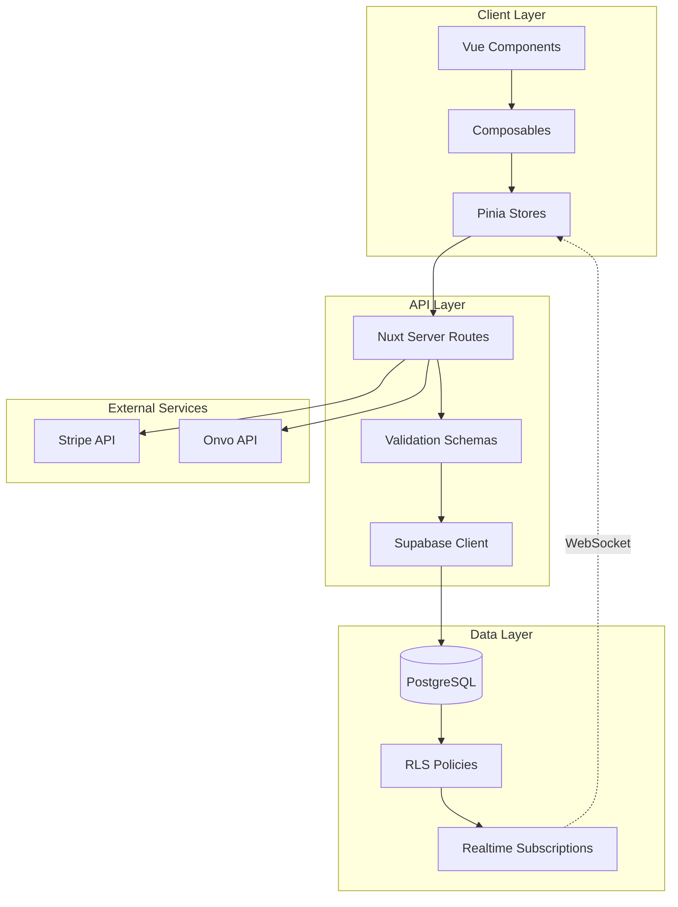
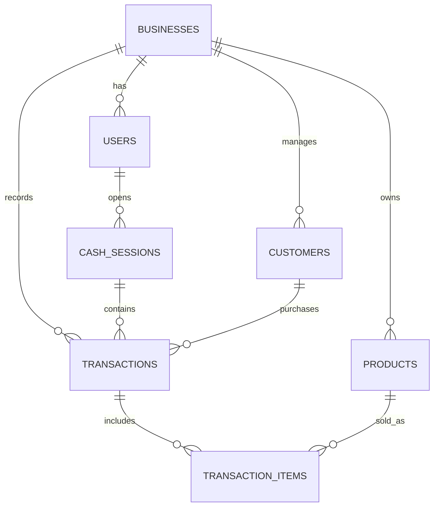

# Lumen Architecture Documentation

## 🏗️ System Overview

**Lumen** is a B2B SaaS platform for financial and operational security designed for SMEs in emerging economies. Built with modern web technologies, it provides real-time transaction auditing, cash flow control, and operational traceability.

## 📋 Tech Stack

### Frontend
- **Framework**: Nuxt 3.4+ (Vue 3.5+ with Composition API)
- **Type Safety**: TypeScript with strict mode
- **Styling**: Vanilla CSS with custom design system
- **UI Components**: Nuxt UI 4.3+ (built on Headless UI)
- **State Management**: Pinia with persistence
- **Internationalization**: @nuxtjs/i18n (ES, EN)

### Backend & Database
- **BaaS**: Supabase (PostgreSQL + Auth + Realtime)
- **API Layer**: Nuxt Server Routes
- **Validation**: Zod schemas
- **Authentication**: Supabase Auth with PKCE flow

### Payment Processing
- **Primary**: Stripe (subscriptions, checkout)
- **Alternative**: Onvo (regional payment provider)

### Development Tools
- **Testing**: Vitest (unit), Playwright (E2E - planned)
- **Linting**: ESLint with Nuxt config
- **Formatting**: Prettier
- **Version Control**: Git with conventional commits

---

## 📁 Project Structure

```
Lumen/
├── app/                          # Application code (srcDir)
│   ├── assets/                   # Static assets
│   ├── components/               # Vue components
│   │   ├── common/              # Shared components
│   │   ├── customers/           # Customer-specific components
│   │   └── users/               # User management components
│   ├── composables/              # Reusable composition functions
│   │   ├── auth/                # Authentication logic
│   │   ├── business/            # Business configuration
│   │   ├── cart/                # Cart and cash register
│   │   ├── customers/           # Customer management
│   │   ├── dashboard/           # Dashboard data
│   │   ├── store/               # Storefront logic
│   │   ├── transactions/        # Transaction handling
│   │   └── utils/               # Utility composables
│   ├── constants/                # Application constants
│   ├── layouts/                  # Page layouts
│   │   ├── auth.vue             # Public pages layout
│   │   ├── default.vue          # Dashboard layout
│   │   └── minimal.vue          # Minimal layout
│   ├── locales/                  # i18n translations
│   │   ├── es.json              # Spanish
│   │   └── en.json              # English
│   ├── middleware/               # Route middleware
│   ├── pages/                    # File-based routing
│   │   ├── index.vue            # Landing page
│   │   ├── login/               # Authentication pages
│   │   ├── dashboard/           # Dashboard
│   │   ├── transactions/        # Transaction management
│   │   ├── products/            # Product catalog
│   │   ├── customers/           # Customer CRM
│   │   └── settings/            # Settings pages
│   ├── stores/                   # Pinia stores
│   │   ├── user.ts              # User state
│   │   └── business.ts          # Business state
│   ├── styles/                   # Global styles
│   │   └── main.css             # Design system
│   ├── types/                    # TypeScript definitions
│   │   ├── database.types.ts    # Supabase generated types
│   │   └── composables/         # Composable types
│   └── utils/                    # Utility functions
├── server/                       # Server-side code
│   ├── api/                      # API endpoints
│   │   ├── auth/                # Authentication endpoints
│   │   ├── businesses/          # Business API
│   │   ├── payments/            # Payment processing
│   │   ├── stripe/              # Stripe integration
│   │   ├── users/               # User management
│   │   └── webhooks/            # Webhook handlers
│   ├── config/                   # Server configuration
│   ├── utils/                    # Server utilities
│   └── validations/              # Zod schemas
├── supabase/                     # Supabase configuration
│   └── migrations/               # Database migrations
├── tests/                        # Test files
│   ├── unit/                     # Unit tests
│   ├── e2e/                      # E2E tests (planned)
│   └── setup.ts                  # Test configuration
├── public/                       # Static files
├── .env                          # Environment variables (gitignored)
├── .env.example                  # Environment template
├── nuxt.config.ts                # Nuxt configuration
├── vitest.config.ts              # Vitest configuration
└── package.json                  # Dependencies
```

---

## 🔄 Data Flow



### Request Flow Example (Create Transaction)

1. **User Action**: Click "Create Sale" in UI
2. **Component**: Calls `useTransactions().createTransaction()`
3. **Composable**: Validates data, calls API endpoint
4. **Server Route**: `/api/transactions/create.post.ts`
5. **Validation**: Zod schema validates payload
6. **Database**: Supabase insert with RLS check
7. **Response**: Transaction created, returns to client
8. **State Update**: Pinia store updates
9. **Realtime**: Other clients receive update via WebSocket
10. **UI Update**: Vue reactivity updates components

---

## 🔐 Authentication & Authorization

### Authentication Flow
1. User enters credentials
2. Supabase Auth validates (PKCE flow)
3. JWT token stored in HTTP-only cookie
4. User profile fetched from `users` table
5. Business context loaded
6. Session persisted with auto-refresh

### Authorization Layers

#### 1. Middleware (`auth.global.ts`)
- Checks authentication status
- Redirects unauthenticated users to `/login`
- Excludes public routes

#### 2. Row Level Security (RLS)
- Every table has `business_id` or `user_id`
- Policies enforce data isolation
- Users only see their business data

#### 3. Role-Based Access
- **Owner**: Full access, billing management
- **Admin**: Cannot delete users or change billing
- **Employee**: Read-only, limited writes

```typescript
// Example RLS Policy (users table)
create policy "Users can view their business users"
  on users for select
  using (business_id = (select business_id from users where id = auth.uid()));
```

---

## 📦 State Management

### Pinia Stores

#### User Store (`stores/user.ts`)
```typescript
interface UserState {
  user: User | null
  profile: UserProfile | null
  business: Business | null
  initialized: boolean
  loading: boolean
  error: string | null
}
```

**Responsibilities:**
- Current user session
- User profile data
- Business context
- Authentication state

**Persistence:** Yes (localStorage via pinia-plugin-persistedstate)

#### Business Store (`stores/business.ts`)
```typescript
interface BusinessState {
  config: BusinessConfig
  subscription: SubscriptionInfo
}
```

**Responsibilities:**
- Business configuration
- Feature flags
- Subscription status

**Persistence:** Yes

---

## 🧩 Composables Architecture

### Naming Convention
- Prefix with `use`: `useAuth`, `useTransactions`
- One composable per domain
- Export single function, not class

### Categories

#### 1. **Domain Composables** (`composables/{domain}/`)
Business logic for specific features:
- `useAuth` - Authentication operations
- `useTransactions` - Transaction CRUD
- `useProducts` - Product management
- `useCustomers` - Customer CRM

#### 2. **Utility Composables** (`composables/utils/`)
Reusable utilities:
- `useFilteredList` - Search & filter logic
- `useNotifications` - Toast notifications
- `useFormValidation` - Form helpers

#### 3. **Store Composables** (`composables/store/`)
Storefront-specific logic:
- `useStorefront` - Public store operations
- `useCart` - Shopping cart logic

### Composable Pattern

```typescript
export const useFeature = () => {
  const supabase = useSupabaseClient<Database>()
  const userStore = useUserStore()
  const loading = ref(false)
  const error = ref<string | null>(null)

  const doSomething = async () => {
    loading.value = true
    try {
      // Business logic
      const { data, error: err } = await supabase
        .from('table')
        .select()
      
      if (err) throw err
      return { success: true, data }
    } catch (e) {
      error.value = (e as Error).message
      return { success: false, error: error.value }
    } finally {
      loading.value = false
    }
  }

  return {
    loading: readonly(loading),
    error: readonly(error),
    doSomething
  }
}
```

---

## 🗄️ Database Schema

### Core Tables

#### `users`
- User accounts and profiles
- Links to `auth.users`
- Contains role, business_id

#### `businesses`
- Business/tenant information
- Owner reference
- Configuration JSON

#### `transactions`
- Sales records
- Links to cash_sessions, customers
- Immutable audit trail

#### `products`
- Product catalog
- Category, pricing, stock
- Business-scoped

#### `customers`
- Customer database
- Contact info, purchase history
- Business-scoped

#### `cash_sessions`
- Cash register sessions
- Opening/closing amounts
- Tied to user shifts

### Relationships



---

## 🎨 Design System

Located in `app/styles/main.css`

### CSS Custom Properties
```css
--color-primary: hsl(222, 47%, 50%);
--color-success: hsl(142, 71%, 45%);
--color-error: hsl(0, 72%, 51%);
--font-sans: 'Inter', system-ui, sans-serif;
```

### Component Classes
- `.btn` - Base button styles
- `.card` - Container with shadow
- `.badge` - Status indicators
- `.form-input` - Styled inputs

**Philosophy**: Utility-first with semantic components, no Tailwind dependency.

---

## 🔄 Realtime Features

### Supabase Realtime Subscriptions

**Active Subscriptions:**
1. **Notifications** - User-specific alerts
2. **Transactions** - Business transactions
3. **Products** - Stock updates

**Pattern:**
```typescript
const channel = supabase
  .channel('business-updates')
  .on('postgres_changes', {
    event: 'INSERT',
    schema: 'public',
    table: 'transactions',
    filter: `business_id=eq.${businessId}`
  }, (payload) => {
    // Handle update
  })
  .subscribe()

// Cleanup on unmount
onUnmounted(() => {
  channel.unsubscribe()
})
```

---

## 🚀 Deployment

### Environment Variables Required
- `SUPABASE_URL`, `SUPABASE_KEY`
- `STRIPE_SECRET_KEY`, `STRIPE_PUBLISHABLE_KEY`
- `SITE_URL`

### Build Process
```bash
npm run build        # Production build
npm run preview      # Local preview
```

### Recommended Platforms
- **Vercel** (recommended - zero-config)
- **Netlify**
- **Any Node.js host**

### CI/CD Checklist
- [ ] Run tests (`npm test`)
- [ ] Type check (`npx nuxi typecheck`)
- [ ] Lint (`npx eslint .`)
- [ ] Build (`npm run build`)
- [ ] Deploy

---

## 📈 Performance Considerations

1. **Code Splitting**: Automatic via Nuxt
2. **Lazy Loading**: Components and routes
3. **Image Optimization**: Use `NuxtImg` for images
4. **Database Indexing**: On `business_id`, `created_at`
5. **Query Limits**: Paginate large lists (100 items max)

---

## 🔒 Security Best Practices

1. **Never trust client input** - Validate on server
2. **Use RLS policies** - Database-level security
3. **Sanitize user content** - Prevent XSS
4. **Rate limiting** - Protect API endpoints (planned)
5. **HTTPS only** - Production requirement
6. **Environment secrets** - Never commit to git

---

## 🧪 Testing Strategy

### Unit Tests (Vitest)
- Composables business logic
- Utility functions
- Store mutations

### E2E Tests (Playwright - Planned)
- Critical user flows
- Authentication
- Transaction creation
- Payment processing

### Coverage Goals
- **Unit**: >80%
- **E2E**: Critical paths

---

## 📝 Contributing Guidelines

See [CONTRIBUTING.md](file:///c:/Users/alexh/OneDrive/Documentos/GitHub/Personal/Lumen/CONTRIBUTING.md) for:
- Coding standards
- Commit conventions
- PR process
- Development workflow

---

**Last Updated**: 2026-01-14  
**Version**: 1.0  
**Maintainer**: Development Team
